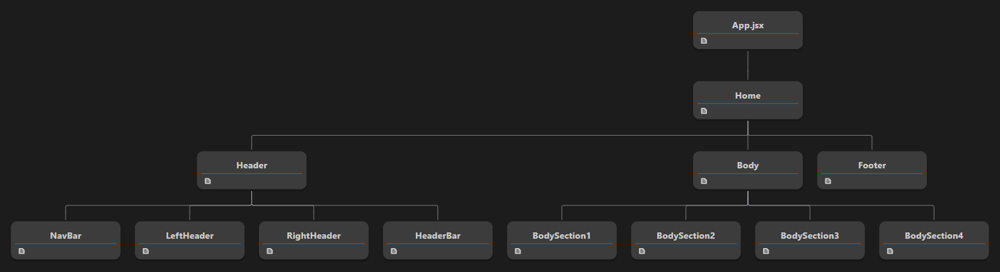
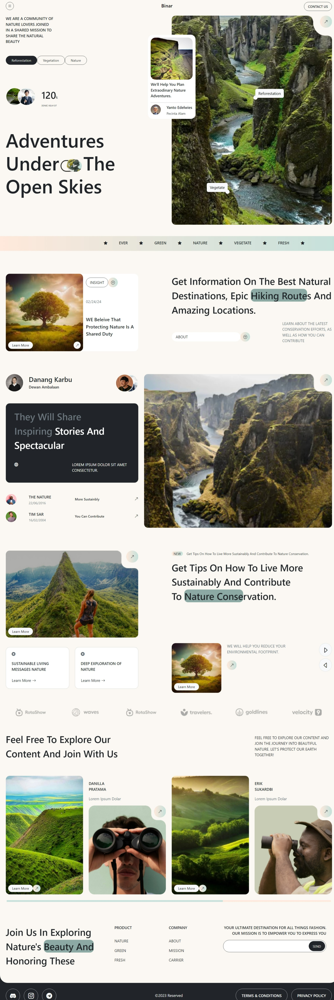

# Binar Nature Landing Page

## URL
https://dribbble.com/shots/22887103-Binar-Nature-Landing-Page

## Features

- Fast development and build process using Vite
- Responsive design with Bootstrap
- Iconography with Bootstrap Icons
- Optimized performance with React Lazy Load.

## Project Structure


## Final Output - PC 


## Installation

To get started with the project, follow these steps:

Before installing, please make sure your machine has Node.js installed. If your machine doesn't have Node.js, please install it [https://nodejs.org/en/download/package-manager]

Install dependencies : 

```sh
npm install
```
Run the development server : 
```sh
npm run dev
```


## Technologies Used

- React
- Vite
- Bootstrap
- Bootstrap Icons
- React Lazy Load
